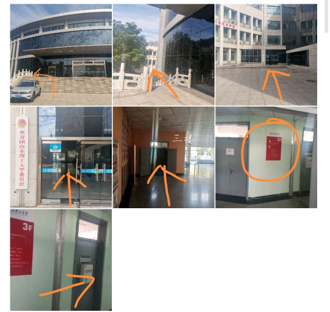

# 常见问题

> 数据库最后更新时间：2023.7.29 16:57

这里收录了当前应用场景（纳新群）的所有常见问题，以下问题均已被写入 AI 星宝的自动应答中！

## 关于星宝/AI 星宝

> Q：星宝/AI 星宝是什么？

星宝是青协的吉祥物，而“AI 星宝”基于 NoneBot2 框架，作用为在校青协纳新群提供常见问题回答辅助，更多详细介绍可以查看[概览](/README.md)

在 QQ 群内，AI 星宝支持以下**通用**指令：

|   指令   |            作用            | 是否需要@AI 星宝 |
| :------: | :------------------------: | :--------------: |
| 星宝贴贴 |    让 AI 星宝与你贴贴！    |        否        |
|   功能   |     查询 AI 星宝的功能     |        是        |
|  /ping   | 检查 AI 星宝目前的连接状态 |        是        |
|  /about  |       获取本文档网址       |        是        |

## 纳新相关

> Q：如何加入校青协？

目前校青协的报名还未开始，届时纳新群内会发相关文件。

简要来说，想要加入校青协，需要对青协及其各个部门有简单的了解，然后根据个人情况填写报名表，将报名表递交到校青协办公室（大学生艺术中心 335），等待面试及结果的公布。

纳新 QQ 群：902419242

> Q：协会在哪？报名表在哪交？

校青协的办公室在大学生艺术中心 3 层 335 室，路线如下：

报名表可以直接放在门口的箱子里，也可以纳新宣讲/稷下会战时顺手塞给摊位现场的工作人员

> Q：报名表在哪？需要发送电子版报名表吗？

电子版报名表在群文件里，不需要提交电子版。

纸质版可以自行打印，也可以等待纳新宣讲/稷下会战白嫖打印好的。

> Q：东校可以加入吗？报名表在哪交？

可以！东校也有许多志愿活动，也可以随时来参加西校的活动，非常欢迎东校的同学加入青协！

东校的报名表暂时待定，一般会安排一个位置统一收集报名表，无需单独跑一次西校。

> Q：各部门招多少人？

每个部门纳新人数不尽相同，各部门最终额定人数在 30 人左右，多数部门会有筛选（即纳新阶段先多招一部分人），详情请询问相应部门答疑人员。

> Q：什么时间截止报名？

报名时间暂未确定。

## 面试相关

> Q：有面试/笔试吗？

各部门都只有面试，没有笔试。

> Q：什么时间面试？在哪面试？

面试的时间地点暂未确定，但每个部门面试的时间和地点不尽相同。

如果已提交报名表的话请等待 QQ/电话/短信通知。

> Q：面试都提问什么？

各个部门的面试问题都不尽相同，具体以各部门为准，大致框架是自我介绍+固定问题提问+随机提问，各个阶段的问题以面试人员为准。

> Q：什么时候确定名单？

暂未确定，届时会在群内发布。

## 协会/各部门相关介绍/问题

### 相关介绍

#### 青年志愿者协会（校青协）

山东理工大学青年志愿者协会是由志愿从事社会公益事业的青年大学生组成的群众性组织，是由山东理工大学团委指导的校级学生组织。协会在校团委的指导下，全面组织、实施志愿者服务活动。协会奉行“奉献、友爱、互助、进步”的准则和“以奉献扬青春，以文明树新风”的宗旨。协会下设办公室、人力资源部、志愿者管理部、宣传部、技术部、项目管理部、赛事运营部七大部门

#### 主席团

这个部门不纳新！！！

#### 办公室

暂时没有办公室的同学[提交](/issue.md)介绍呢~

#### 人力资源部（人力）

人力资源部门主要负责:

(一)更新管理志愿者工时，做好工时认证并转录为二课学分工作，到梦空间的使用管理。

（二）制定人事任用奖惩参考制度，对内部干部的选拔、任用提供参考建议。

（三）按时更新管理志愿者工时，做好工时认证并转录为二课学分工作。

#### 志愿者管理部（志管）

暂时还没有志管的同学[提交](/issue.md)介绍呢~

#### 宣传部（宣传）

暂时还没有宣传的同学[提交](/issue.md)介绍呢~

#### 技术部（技术）

> 关于技术部的超详细介绍可以看这里：[技术部](/?target=yva-tech)

简述：

技术部主要为协会各方面工作提供技术支持，运用专业软件（本学期含 PS/PR/摄影培训）制作所需要的图像/视频等媒体材料、对协会的各种活动进行跟进并记录、为协会的媒体矩阵、运营矩阵、活动矩阵提供所需素材，在各个方面提供多样化、标准化、专业化、规范化、信息化的多元化解决方案。

招募需求：喜欢参加志愿活动，并对摄影/PS 制作/视频剪辑运营/绘画其中之一**有兴趣**即可报名！

注：技术部与其他部门参与志愿活动的机会基本一样哦，欢迎大家加入技术部！

#### 项目管理部（项目）

暂时还没有项目的同学[提交](/issue.md)介绍呢~

#### 赛事运营部（赛事）

赛事运营部主要负责的是“挑战二十一天”，环保工艺品制作大赛，医疗技能大赛以及驻淄高校应急救护电视大赛选拔赛等大型活动。赛事运营部的志愿者们主要负责活动的前期策划。中期执行、后期评估，并在志愿服务活动中协调工作人员和参赛人员确保志愿服务活动正常顺利地进行。

### 相关问题

> Q：青协是不是要求比较高？想加入的话需要准备点什么？

完全没要求，需要准备一颗勇于奉献的爱心~

> Q：有推荐的部门吗？那个部门比较好进？竞争压力大吗？

所有部门都不错，都很推荐，具体需要结合个人情况选择。

所有组织和部门的竞争压力都是一样的，大家对某个部门感兴趣直接冲就好！

## 志愿活动相关

> Q：志愿活动/志愿者是什么？都有哪些志愿活动？我可以成为志愿者吗？

志愿活动是指自愿参加的、无偿的、为社会公益事业服务的活动，志愿者狭义上指的是参与志愿活动的人，广义上任何人都可以是志愿者。校青协为山理工**唯一的校级志愿服务组织**，基本可以接触大学生活中各式各样的志愿服务活动，如四六级/教资/考研志愿者、淄博各大赛事青年志愿者、校医院相关志愿者等，更多志愿活动资讯可以关注微信公众号「志愿山理工」。

> Q：如何参加志愿活动？如果没竞选成功还能参加吗？

校青协承接的志愿活动会在纳新结束后在青协的组织群内优先发布，若人数不齐将会在**本群**内发布，**所以不论想不想进入青协，只要想参加志愿活动都可以在群内留一下**

需要注意的是，山理工不只有校青协一个志愿活动组织，但校青协是唯一一个**校级**志愿活动组织。

> Q：部门工作/志愿活动累吗？

所有部门的工作和志愿活动都是自愿报名的，累不累自己说了算！

> Q：志愿活动有哪些实质奖励？

一部分志愿活动会有志愿证书（招募时会说明），所有志愿活动都会有工时记录，也有认证的工时本记录，可以等比转化为二课分，部分学院可以加综测（**各学院政策不同**，详情请问自己学院的学长学姐）。

> Q：工时如何计算？在哪里查询工时？

正常参与志愿活动时，工时按 1 工时/小时计算，各个部门的特色志愿工作也会加相应的工时。工时将由活动负责人统计、人力资源部进行统计、宣传部进行推文推送，最终可以在微信公众号「志愿山理工」查看每周的工时情况。

---

由[docsify](https://github.com/docsifyjs/docsify/)提供强有力的文档框架支持！ 由[Nonebot2](https://github.com/nonebot/nonebot2)提供强有力的 QQbot 框架支持！
